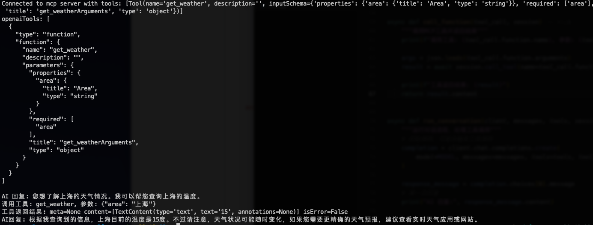
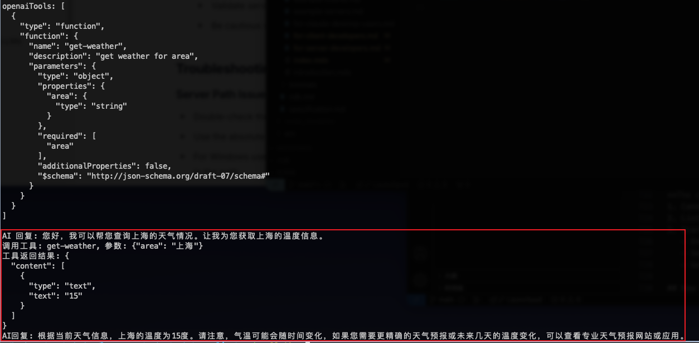

在本教程中，你将学习如何构建一个连接到 MCP 服务器的 LLM 驱动的聊天机器人客户端。你最好先学习开发 MCP 服务器，该指南将引导你了解构建第一个 MCP 服务器的基础知识。

<Tabs>
  <TabItem value="Python" label="Python">

[点击这里查看完整代码](https://github.com/geekdogxy/learn-mcp/tree/main/codes/python/mcp-client)

## 系统要求

开始之前，请确保您的系统满足以下要求：

- Mac 或 Windows 电脑
- 安装最新版本的 Python 和 Pip
- OpenRouter API key ( https://openrouter.ai/settings/keys )

## 设置您的环境

```bash
python --version
pip --version

pip install mcp openai python-dotenv
```

## 设置您的 API Key

```bash
BASE_URL=https://openrouter.ai/api/v1
MODEL=anthropic/claude-3.7-sonnet
API_KEY=YOUR_API_KEY
```

## 你的第一个 MCP 客户端

### 创建 MCP 客户端，连接 MCP 服务器

```python
# 连接 mcp 服务器，这里使用 python 启动 weather.py
# 请根据实际情况更改 weather.py 文件路径
server_params = StdioServerParameters(
    command="python",  # Executable
    args=[
        "/Users/xy/Desktop/mcp/website/learn-mcp/codes/python/weather-server/weather.py"
    ],
    env=None,
)

async def main():
    async with stdio_client(server_params) as (read, write):
        async with ClientSession(read, write) as session:
            # Initialize the connection
            await session.initialize()
            # List available tools
            ret = await session.list_tools()
            tools = ret.tools
            print("Connected to mcp server with tools:", [tool for tool in tools])
            openai_tools = convert_to_openai_tools(tools)
            print(f"openaiTools: {json.dumps(openai_tools, indent=2)}\n")


def convert_to_openai_tools(mcp_tools: List[Dict[str, Any]]) -> List[Dict[str, Any]]:
    """将MCP工具转换为OpenAI格式的工具"""
    return [
        {
            "type": "function",
            "function": {
                "name": tool.name,
                "description": tool.description,
                "parameters": tool.inputSchema,
            },
        }
        for tool in mcp_tools
    ]

```

### 创建 OpenAI 客户端，处理用户请求和 MCP 调用

```python

# 初始化OpenAI
client = OpenAI(api_key=API_KEY, base_url=BASE_URL)
# 用户查询
query = "请问上海的温度多少度"
messages = [{"role": "user", "content": query}]
await run_conversation(client, messages, openai_tools, session)


async def call_function(tool_call, session):
    """调用MCP工具并返回结果"""
    print(f"调用工具: {tool_call.function.name}, 参数: {tool_call.function.arguments}")

    args = json.loads(tool_call.function.arguments)
    result = await session.call_tool(name=tool_call.function.name, arguments=args)

    print(f"工具返回结果: {result}")
    return result.content


async def run_conversation(client, messages, tools, session):
    """运行对话流程，处理工具调用"""
    # 初始调用，可能会触发工具调用
    completion = client.chat.completions.create(
        model=MODEL, messages=messages, tools=tools, tool_choice="auto"
    )

    response_message = completion.choices[0].message
    # 第一次回复
    print("AI 回复:", response_message.content)

    # 判断是否需要调用工具
    if response_message.tool_calls:
        # 将AI回复加入对话历史
        messages.append(response_message.model_dump())

        # 处理每个工具调用
        for tool_call in response_message.tool_calls:
            result = await call_function(tool_call, session)

            # 将工具调用结果加入对话历史
            messages.append(
                {
                    "role": "tool",
                    "tool_call_id": tool_call.id,
                    "content": result,
                }
            )

        # 使用工具调用结果再次调用模型获取最终回复
        second_completion = client.chat.completions.create(
            model=MODEL,
            messages=messages,
        )

        final_message = second_completion.choices[0].message
        print("AI回复:", final_message.content)
        return final_message.content

```

### 程序主入口点

```python
if __name__ == "__main__":
    import asyncio

    asyncio.run(main())
```

## 运行客户端

```bash
python client.py
```



  </TabItem>

  <TabItem value="Node" label="Node">

[点击这里查看完整代码](https://github.com/geekdogxy/learn-mcp/tree/main/codes/node/mcp-client)

## 系统要求

开始之前，请确保您的系统满足以下要求：

- Mac 或 Windows 电脑
- 安装 Node.js 16 或更高版本
- 安装最新版本的 `npm`
- OpenRouter API key ( https://openrouter.ai/settings/keys )

## 设置您的环境

```bash
node --version
npm --version

npm init -y
npm install @modelcontextprotocol/sdk dotenv openai
```

## 设置您的 API Key

```bash
BASE_URL=https://openrouter.ai/api/v1
MODEL=anthropic/claude-3.7-sonnet
API_KEY=YOUR_API_KEY
```

## 你的第一个 MCP 客户端

### 创建 MCP 客户端，连接 MCP 服务器

```javascript
// 连接 mcp 服务器，这里使用node启动weather.js
// 请根据实际情况更改 weather.js 文件路径
const transport = new StdioClientTransport({
  command: 'node',
  args: ['/Users/xy/Desktop/mcp/website/learn-mcp/codes/node/weather-server/weather.js'],
});

const mcpClient = new Client({
  name: 'mcp-client',
  version: '1.0.0',
});

await mcpClient.connect(transport);

// 获取 mcp server tools
const ret = await mcpClient.listTools();
const { tools } = ret;
console.log(
  'Connected to mcp server with tools:',
  tools.map(({ name }) => name)
);
console.log(`mcpTools: ${JSON.stringify(tools, null, 2)}\n`);

// 转换MCP tools到OpenAI格式
const convertToOpenAITools = (mcpTools) => {
  return mcpTools.map((tool) => ({
    type: 'function',
    function: {
      name: tool.name,
      description: tool.description,
      parameters: tool.inputSchema,
    },
  }));
};

const openaiTools = convertToOpenAITools(tools);
console.log(`openaiTools: ${JSON.stringify(openaiTools, null, 2)}\n`);
```

### 创建 OpenAI 客户端，处理用户请求和 MCP 调用

```javascript
// 初始化OpenAI
const openai = new OpenAI({
  apiKey: API_KEY,
  baseURL: BASE_URL,
});

// 调用OpenAI
const query = `请问上海的天气多少度`;
const messages = [{ role: 'user', content: query }];
let toolCalls = [];

async function callFunction(toolCall) {
  console.log(`调用工具: ${toolCall.function.name}, 参数: ${toolCall.function.arguments}`);

  const args = JSON.parse(toolCall.function.arguments);
  const result = await mcpClient.callTool({
    name: toolCall.function.name,
    arguments: args,
  });

  console.log(`工具返回结果: ${JSON.stringify(result, null, 2)}`);
  return result.content;
}

async function runConversation() {
  // 初始调用，可能会触发工具调用
  const completion = await openai.chat.completions.create({
    model: MODEL,
    messages,
    tools: openaiTools,
    tool_choice: 'auto',
  });

  const responseMessage = completion.choices[0].message;
  // 第一次回复
  console.log('AI 回复:', responseMessage.content);

  // 判断是否需要调用工具
  if (responseMessage.tool_calls) {
    // 将AI回复加入对话历史
    messages.push(responseMessage);

    // 处理每个工具调用
    for (const toolCall of responseMessage.tool_calls) {
      const result = await callFunction(toolCall);

      // 将工具调用结果加入对话历史
      messages.push({
        role: 'tool',
        tool_call_id: toolCall.id,
        content: result,
      });
    }

    // 使用工具调用结果再次调用模型获取最终回复
    const secondCompletion = await openai.chat.completions.create({
      model: MODEL,
      messages,
    });

    const finalMessage = secondCompletion.choices[0].message;
    console.log('AI回复:', finalMessage.content);
    return finalMessage.content;
  }
}
```

### 程序主入口点

```javascript
// 运行对话流程
runConversation()
  .then((result) => {
    process.exit(0);
  })
  .catch((error) => {
    console.error('发生错误:', error);
    process.exit(1);
  });
```

## 运行客户端

```bash
node client.js
```



  </TabItem>

</Tabs>

## 工作原理

当您提交查询时：

1. 客户端从服务器获取可用工具列表
2. 你的查询和工具描述一起发送给 Claude
3. Claude 决定使用哪些工具（如果有的话）
4. 客户端通过服务器执行任何请求的工具调用
5. 结果发送回 Claude
6. Claude 提供自然语言响应
7. 响应显示给你

import Tabs from '@theme/Tabs';
import TabItem from '@theme/TabItem';
