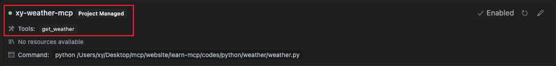
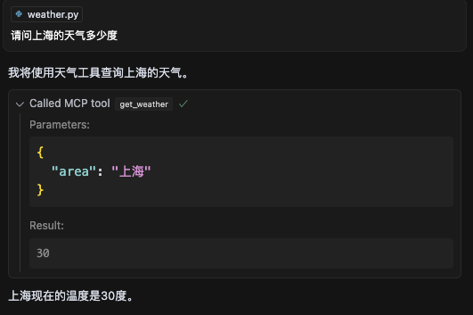

在本教程中，我们将构建一个简单的 MCP 天气服务器并将其连接到宿主程序 Cursor。我们将从基本设置开始，然后逐步进行更复杂的用例。

## 我们将构建什么

许多 LLM（包括 Claude）目前还没有获取温度的能力。让我们使用 MCP 来解决这个问题！

我们将构建一个服务器，提供 1 个工具：`get-weather`。然后我们将服务器连接到 MCP 宿主程序（在本例中是 Cursor）

:::tip
MCP 服务器可以连接任何客户端。默认官方提供 Claude Desktop，但是这个客户端在大陆不可用

个人建议可以使用 Cursor/ RooCline/ CherryStudio 等代替，`这里我们会使用 Cursor 来演示`
:::

## MCP 核心概念

MCP 服务器可以提供三种主要类型的功能：

1. **资源（Resources）**：类文件数据，可被客户端读取（如 API 响应或文件内容）
2. **工具（Tools）**：可被 LLM 调用的函数（需用户批准）
3. **提示（Prompts）**：预先编写的模板，帮助用户完成特定任务

本教程将主要关注工具。

## 你的第一个 MCP 服务器

<Tabs>
  <TabItem value="Python" label="Python">
让我们开始构建我们的天气服务器！[您可以在这里找到我们将要构建的完整代码。](https://github.com/geekdogxy/learn-mcp/tree/main/codes/python/weather)

### 前置知识

本快速入门假设您熟悉：

- Python
- LLM，如 Claude-3.7-Sonnet 或者 GPT-4O

### 系统要求

- 安装 Python 3.10 或更高版本
- 安装 Pip

### 设置你的环境

首先，让我们安装官方 SDK

```bash
pip install mcp
```

### 构建 MCP 服务器

```python
from typing import Any
import random
from mcp.server.fastmcp import FastMCP

# 初始化MCP服务器
mcp = FastMCP("weather")

# 每个tool具体逻辑 这里模拟获取温度
@mcp.tool()
async def get_weather(area: str) -> str:
  # 模拟温度 实际可以调用天气API
  temperature = random.choice([1, 15, 30])
  return f"{temperature}"

# 启动MCP服务器
if __name__ == "__main__":
  mcp.run()
```

### 使用 Cursor 测试

为了方便测试，我们在当前目录创建 `.cursor` 目录，并且设置配置文件 `mcp.json`

```json
{
  "mcpServers": {
    "xy-weather-mcp": {
      "command": "python",
      "args": ["{your-path}/weather.py"]
    }
  }
}
```

:::info

字段含义:

- mcpServers 是主配置对象，包含所有 MCP 服务器的配置
- xy-weather-mcp 是自定义的服务器名称，可以根据需求命名
- command 指定运行服务器的命令，这里是 python
- args 是传递给命令的参数，这里是 Python 脚本的完整路径

以上配置告诉 Cursor：

当需要使用名为 `xy-weather-mcp` 的 MCP 服务器时，应该执行 `python {your-path}/weather.py` 命令来启动服务器

这样设置后，Cursor 就能识别并连接到你的自定义 MCP 天气服务器，使 LLM 能够调用你定义的 get_weather 工具

:::

一旦配置好，当你在 Cursor 设置看到下图就说明成功了



下面我们开始测试，询问 AI 当前温度，如下图所示，Cursor 成功调用了我们写的 MCP 服务器



:::tip

### 背后发生了什么

当你提出问题时：

1.  客户端将你的问题发送给 Cursor
2.  Cursor 分析可用的工具并决定使用哪一个（或多个）
3.  客户端通过 MCP 服务器执行所选工具
4.  结果被发送回 Cursor
5.  Claude 形成自然语言响应
6.  响应显示给你！

:::

       </TabItem>

         <TabItem value="Node" label="Node">
           这是橙子的内容
         </TabItem>

         <TabItem value="Java" label="Java">
           这是香蕉的内容
         </TabItem>

       </Tabs>

import Tabs from '@theme/Tabs';
import TabItem from '@theme/TabItem';
