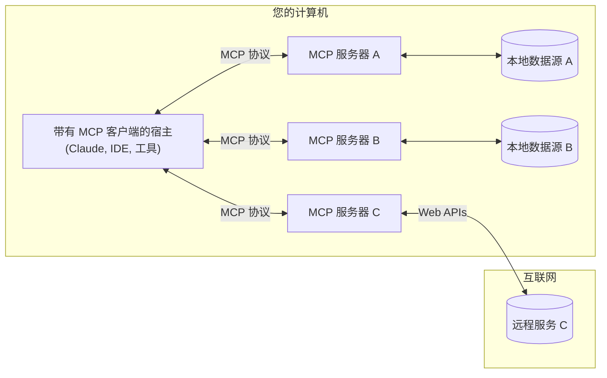

MCP 是一个开放协议，它标准化了应用程序如何向 LLM 提供上下文。可以将 MCP 视为 AI 应用程序的 USB-C 接口。就像 USB-C 为连接设备与各种外设和配件提供了标准化方式，MCP 为连接 AI 模型与不同数据源和工具提供了标准化方式

## 为什么选择 MCP？

MCP 帮助您在 LLM 之上构建代理和复杂工作流。LLM 经常需要与数据和工具集成，而 MCP 提供：

- 一系列不断增长的预构建集成，您的 LLM 可以直接使用
- 在 LLM 提供商和供应商之间切换的灵活性
- 在您的基础设施内保护数据的最佳实践

### 总体架构

MCP 的核心是遵循客户端 - 服务器架构，其中一个宿主应用程序可以连接到多个服务器：

- **MCP 宿主**：想要通过 MCP 访问数据的程序，如 Claude Desktop、IDE 或 AI 工具
- **MCP 客户端**：与服务器保持 1:1 连接的协议客户端
- **MCP 服务器**：通过标准化的模型上下文协议暴露特定功能的轻量级程序
- **本地数据源**：MCP 服务器可以安全访问的计算机文件、数据库和服务
- **远程服务**：MCP 服务器可以连接的通过互联网（例如通过 API）提供的外部系统

## 入门指南

选择最适合您需求的学习路径：

### 快速开始

<DocCardList
  items={[
    {
      type: 'link',
      label: '开发 MCP 服务器',
      href: '/docs/get-started/for-server-developers',
      description: '开始构建您自己的服务器，用于Claude桌面版和其他客户端',
    },
    {
      type: 'link',
      label: '开发 MCP 客户端',
      href: '/docs/get-started/for-client-developers',
      description: '开始构建您自己的客户端，可与所有MCP服务器集成',
    },
    {
      type: 'link',
      label: '使用 Claude 客户端',
      href: '/docs/get-started/for-claude-desktop-users',
      description: '开始在Claude桌面版中使用预构建的服务器',
    },
  ]}
/>

### 示例

<DocCardList
  items={[
    {
      type: 'link',
      label: 'MCP 服务器示例',
      href: '/docs/get-started/example-servers',
      description: '查看我们的官方MCP服务器和实现示例库',
    },
    {
      type: 'link',
      label: 'MCP 客户端示例',
      href: '/docs/get-started/example-clients',
      description: '查看支持MCP集成的客户端列表',
    },
  ]}
/>

## 教程

<DocCardList
  items={[
    {
      type: 'link',
      label: '教程',
      href: '/docs/tutorials',
      description: 'MCP 学习教程',
    },
  ]}
/>

## 探索 MCP

<DocCardList
  items={[
    {
      type: 'link',
      label: '概念',
      href: '/docs/concepts',
      description: '深入学习 MCP 的核心概念和功能',
    },
  ]}
/>

## 支持与反馈

以下是获取帮助或提供反馈的方式：

- 对于与 MCP 规范、SDK 或文档（开源）相关的错误报告和功能请求，请[创建 GitHub issue](https://github.com/modelcontextprotocol)
- 对于关于 MCP 规范的讨论或问答，请使用[规范讨论](https://github.com/modelcontextprotocol/specification/discussions)
- 对于关于其他 MCP 开源组件的讨论或问答，请使用[组织讨论](https://github.com/orgs/modelcontextprotocol/discussions)
- 对于与 Claude.app 和 claude.ai 的 MCP 集成相关的错误报告、功能请求和问题，请发送电子邮件至 mcp-support@anthropic.com

import DocCard from '@theme/DocCard';
import DocCardList from '@theme/DocCardList';
