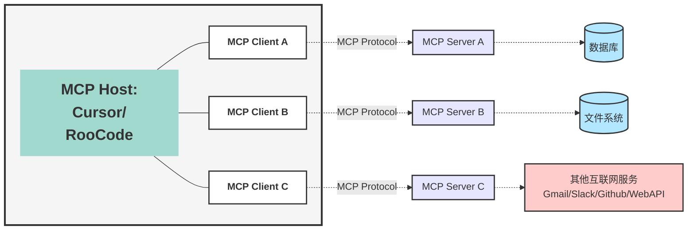

# 你好

```mermaid
graph LR
  subgraph Host[" "]
      direction TB
      Title["MCP Host:<br/> Cursor/ RooCode"]
      C1[MCP Client A]
      C2[MCP Client B]
      C3["MCP Client C"]
      Title --- C1
      Title --- C2
      Title --- C3
  end

  subgraph S1["MCP Server A"]
  end

  subgraph S2["MCP Server B"]
  end

  subgraph S3["MCP Server C"]
  end

  DB1[(数据库)]
  DB2[(文件系统)]
  Cloud[其他互联网服务<br>Gmail/Slack/Github/WebAPI]

  C1 -.MCP Protocol.-> S1
  C2 -.MCP Protocol.-> S2
  C3 -.MCP Protocol.-> S3

  S1 -.-> DB1
  S2 -.-> DB2
  S3 -.-> Cloud

  style Host fill:#f5f5f5,stroke:#333,stroke-width:3px
  style S1 fill:#e6e6ff,stroke:#333,stroke-width:2px
  style S2 fill:#e6e6ff,stroke:#333,stroke-width:2px
  style S3 fill:#e6e6ff,stroke:#333,stroke-width:2px

  style C1 fill:#fff,stroke:#333,stroke-width:2px,font-weight:bold
  style C2 fill:#fff,stroke:#333,stroke-width:2px,font-weight:bold
  style C3 fill:#fff,stroke:#333,stroke-width:2px,font-weight:bold
  style Title fill:#a2d9ce,stroke:none,font-size:25px,font-weight:bold

  style DB1 fill:#b3e6ff,stroke:#333,stroke-width:2px
  style DB2 fill:#b3e6ff,stroke:#333,stroke-width:2px
  style Cloud fill:#ffcccc,stroke:#333,stroke-width:2px
```
